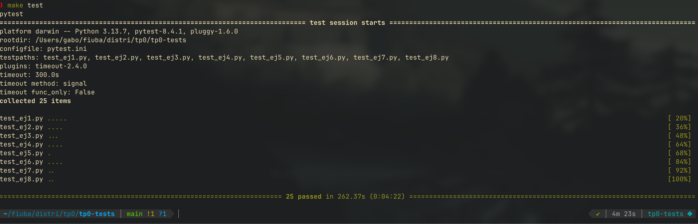

# TP0: Docker + Comunicaciones + Concurrencia

En el presente repositorio se provee un esqueleto básico de cliente/servidor, en donde todas las dependencias del mismo se encuentran encapsuladas en containers. Los alumnos deberán resolver una guía de ejercicios incrementales, teniendo en cuenta las condiciones de entrega descritas al final de este enunciado.

 El cliente (Golang) y el servidor (Python) fueron desarrollados en diferentes lenguajes simplemente para mostrar cómo dos lenguajes de programación pueden convivir en el mismo proyecto con la ayuda de containers, en este caso utilizando [Docker Compose](https://docs.docker.com/compose/).

---

## Resolución de Ejercicios

Al final de este documento se encuentran las soluciones a cada ejercicio, usa el [siguiente link](#implementación-de-ejercicios) para ir directo a esta sección!

_NOTA: Se hace uso de algunas features de markdown exclusivas a Github, recomiendo leerlo en esa dicha plataforma ;)_


---

## Instrucciones de uso
El repositorio cuenta con un **Makefile** que incluye distintos comandos en forma de targets. Los targets se ejecutan mediante la invocación de:  **make \<target\>**. Los target imprescindibles para iniciar y detener el sistema son **docker-compose-up** y **docker-compose-down**, siendo los restantes targets de utilidad para el proceso de depuración.

Los targets disponibles son:

| target  | accion  |
|---|---|
|  `docker-compose-up`  | Inicializa el ambiente de desarrollo. Construye las imágenes del cliente y el servidor, inicializa los recursos a utilizar (volúmenes, redes, etc) e inicia los propios containers. |
| `docker-compose-down`  | Ejecuta `docker-compose stop` para detener los containers asociados al compose y luego  `docker-compose down` para destruir todos los recursos asociados al proyecto que fueron inicializados. Se recomienda ejecutar este comando al finalizar cada ejecución para evitar que el disco de la máquina host se llene de versiones de desarrollo y recursos sin liberar. |
|  `docker-compose-logs` | Permite ver los logs actuales del proyecto. Acompañar con `grep` para lograr ver mensajes de una aplicación específica dentro del compose. |
| `docker-image`  | Construye las imágenes a ser utilizadas tanto en el servidor como en el cliente. Este target es utilizado por **docker-compose-up**, por lo cual se lo puede utilizar para probar nuevos cambios en las imágenes antes de arrancar el proyecto. |
| `build` | Compila la aplicación cliente para ejecución en el _host_ en lugar de en Docker. De este modo la compilación es mucho más veloz, pero requiere contar con todo el entorno de Golang y Python instalados en la máquina _host_. |

### Servidor

Se trata de un "echo server", en donde los mensajes recibidos por el cliente se responden inmediatamente y sin alterar. 

Se ejecutan en bucle las siguientes etapas:

1. Servidor acepta una nueva conexión.
2. Servidor recibe mensaje del cliente y procede a responder el mismo.
3. Servidor desconecta al cliente.
4. Servidor retorna al paso 1.


### Cliente
 se conecta reiteradas veces al servidor y envía mensajes de la siguiente forma:
 
1. Cliente se conecta al servidor.
2. Cliente genera mensaje incremental.
3. Cliente envía mensaje al servidor y espera mensaje de respuesta.
4. Servidor responde al mensaje.
5. Servidor desconecta al cliente.
6. Cliente verifica si aún debe enviar un mensaje y si es así, vuelve al paso 2.

### Ejemplo

Al ejecutar el comando `make docker-compose-up`  y luego  `make docker-compose-logs`, se observan los siguientes logs:

```
client1  | 2024-08-21 22:11:15 INFO     action: config | result: success | client_id: 1 | server_address: server:12345 | loop_amount: 5 | loop_period: 5s | log_level: DEBUG
client1  | 2024-08-21 22:11:15 INFO     action: receive_message | result: success | client_id: 1 | msg: [CLIENT 1] Message N°1
server   | 2024-08-21 22:11:14 DEBUG    action: config | result: success | port: 12345 | listen_backlog: 5 | logging_level: DEBUG
server   | 2024-08-21 22:11:14 INFO     action: accept_connections | result: in_progress
server   | 2024-08-21 22:11:15 INFO     action: accept_connections | result: success | ip: 172.25.125.3
server   | 2024-08-21 22:11:15 INFO     action: receive_message | result: success | ip: 172.25.125.3 | msg: [CLIENT 1] Message N°1
server   | 2024-08-21 22:11:15 INFO     action: accept_connections | result: in_progress
server   | 2024-08-21 22:11:20 INFO     action: accept_connections | result: success | ip: 172.25.125.3
server   | 2024-08-21 22:11:20 INFO     action: receive_message | result: success | ip: 172.25.125.3 | msg: [CLIENT 1] Message N°2
server   | 2024-08-21 22:11:20 INFO     action: accept_connections | result: in_progress
client1  | 2024-08-21 22:11:20 INFO     action: receive_message | result: success | client_id: 1 | msg: [CLIENT 1] Message N°2
server   | 2024-08-21 22:11:25 INFO     action: accept_connections | result: success | ip: 172.25.125.3
server   | 2024-08-21 22:11:25 INFO     action: receive_message | result: success | ip: 172.25.125.3 | msg: [CLIENT 1] Message N°3
client1  | 2024-08-21 22:11:25 INFO     action: receive_message | result: success | client_id: 1 | msg: [CLIENT 1] Message N°3
server   | 2024-08-21 22:11:25 INFO     action: accept_connections | result: in_progress
server   | 2024-08-21 22:11:30 INFO     action: accept_connections | result: success | ip: 172.25.125.3
server   | 2024-08-21 22:11:30 INFO     action: receive_message | result: success | ip: 172.25.125.3 | msg: [CLIENT 1] Message N°4
server   | 2024-08-21 22:11:30 INFO     action: accept_connections | result: in_progress
client1  | 2024-08-21 22:11:30 INFO     action: receive_message | result: success | client_id: 1 | msg: [CLIENT 1] Message N°4
server   | 2024-08-21 22:11:35 INFO     action: accept_connections | result: success | ip: 172.25.125.3
server   | 2024-08-21 22:11:35 INFO     action: receive_message | result: success | ip: 172.25.125.3 | msg: [CLIENT 1] Message N°5
client1  | 2024-08-21 22:11:35 INFO     action: receive_message | result: success | client_id: 1 | msg: [CLIENT 1] Message N°5
server   | 2024-08-21 22:11:35 INFO     action: accept_connections | result: in_progress
client1  | 2024-08-21 22:11:40 INFO     action: loop_finished | result: success | client_id: 1
client1 exited with code 0
```


## Parte 1: Introducción a Docker
En esta primera parte del trabajo práctico se plantean una serie de ejercicios que sirven para introducir las herramientas básicas de Docker que se utilizarán a lo largo de la materia. El entendimiento de las mismas será crucial para el desarrollo de los próximos TPs.

### Ejercicio N°1:
Definir un script de bash `generar-compose.sh` que permita crear una definición de Docker Compose con una cantidad configurable de clientes.  El nombre de los containers deberá seguir el formato propuesto: client1, client2, client3, etc. 

El script deberá ubicarse en la raíz del proyecto y recibirá por parámetro el nombre del archivo de salida y la cantidad de clientes esperados:

`./generar-compose.sh docker-compose-dev.yaml 5`

Considerar que en el contenido del script pueden invocar un subscript de Go o Python:

```
#!/bin/bash
echo "Nombre del archivo de salida: $1"
echo "Cantidad de clientes: $2"
python3 mi-generador.py $1 $2
```

En el archivo de Docker Compose de salida se pueden definir volúmenes, variables de entorno y redes con libertad, pero recordar actualizar este script cuando se modifiquen tales definiciones en los sucesivos ejercicios.

### Ejercicio N°2:
Modificar el cliente y el servidor para lograr que realizar cambios en el archivo de configuración no requiera reconstruír las imágenes de Docker para que los mismos sean efectivos. La configuración a través del archivo correspondiente (`config.ini` y `config.yaml`, dependiendo de la aplicación) debe ser inyectada en el container y persistida por fuera de la imagen (hint: `docker volumes`).


### Ejercicio N°3:
Crear un script de bash `validar-echo-server.sh` que permita verificar el correcto funcionamiento del servidor utilizando el comando `netcat` para interactuar con el mismo. Dado que el servidor es un echo server, se debe enviar un mensaje al servidor y esperar recibir el mismo mensaje enviado.

En caso de que la validación sea exitosa imprimir: `action: test_echo_server | result: success`, de lo contrario imprimir:`action: test_echo_server | result: fail`.

El script deberá ubicarse en la raíz del proyecto. Netcat no debe ser instalado en la máquina _host_ y no se pueden exponer puertos del servidor para realizar la comunicación (hint: `docker network`). `


### Ejercicio N°4:
Modificar servidor y cliente para que ambos sistemas terminen de forma _graceful_ al recibir la signal SIGTERM. Terminar la aplicación de forma _graceful_ implica que todos los _file descriptors_ (entre los que se encuentran archivos, sockets, threads y procesos) deben cerrarse correctamente antes que el thread de la aplicación principal muera. Loguear mensajes en el cierre de cada recurso (hint: Verificar que hace el flag `-t` utilizado en el comando `docker compose down`).

## Parte 2: Repaso de Comunicaciones

Las secciones de repaso del trabajo práctico plantean un caso de uso denominado **Lotería Nacional**. Para la resolución de las mismas deberá utilizarse como base el código fuente provisto en la primera parte, con las modificaciones agregadas en el ejercicio 4.

### Ejercicio N°5:
Modificar la lógica de negocio tanto de los clientes como del servidor para nuestro nuevo caso de uso.

#### Cliente
Emulará a una _agencia de quiniela_ que participa del proyecto. Existen 5 agencias. Deberán recibir como variables de entorno los campos que representan la apuesta de una persona: nombre, apellido, DNI, nacimiento, numero apostado (en adelante 'número'). Ej.: `NOMBRE=Santiago Lionel`, `APELLIDO=Lorca`, `DOCUMENTO=30904465`, `NACIMIENTO=1999-03-17` y `NUMERO=7574` respectivamente.

Los campos deben enviarse al servidor para dejar registro de la apuesta. Al recibir la confirmación del servidor se debe imprimir por log: `action: apuesta_enviada | result: success | dni: ${DNI} | numero: ${NUMERO}`.


#### Servidor
Emulará a la _central de Lotería Nacional_. Deberá recibir los campos de la cada apuesta desde los clientes y almacenar la información mediante la función `store_bet(...)` para control futuro de ganadores. La función `store_bet(...)` es provista por la cátedra y no podrá ser modificada por el alumno.
Al persistir se debe imprimir por log: `action: apuesta_almacenada | result: success | dni: ${DNI} | numero: ${NUMERO}`.

#### Comunicación:
Se deberá implementar un módulo de comunicación entre el cliente y el servidor donde se maneje el envío y la recepción de los paquetes, el cual se espera que contemple:
* Definición de un protocolo para el envío de los mensajes.
* Serialización de los datos.
* Correcta separación de responsabilidades entre modelo de dominio y capa de comunicación.
* Correcto empleo de sockets, incluyendo manejo de errores y evitando los fenómenos conocidos como [_short read y short write_](https://cs61.seas.harvard.edu/site/2018/FileDescriptors/).


### Ejercicio N°6:
Modificar los clientes para que envíen varias apuestas a la vez (modalidad conocida como procesamiento por _chunks_ o _batchs_). 
Los _batchs_ permiten que el cliente registre varias apuestas en una misma consulta, acortando tiempos de transmisión y procesamiento.

La información de cada agencia será simulada por la ingesta de su archivo numerado correspondiente, provisto por la cátedra dentro de `.data/datasets.zip`.
Los archivos deberán ser inyectados en los containers correspondientes y persistido por fuera de la imagen (hint: `docker volumes`), manteniendo la convencion de que el cliente N utilizara el archivo de apuestas `.data/agency-{N}.csv` .

En el servidor, si todas las apuestas del *batch* fueron procesadas correctamente, imprimir por log: `action: apuesta_recibida | result: success | cantidad: ${CANTIDAD_DE_APUESTAS}`. En caso de detectar un error con alguna de las apuestas, debe responder con un código de error a elección e imprimir: `action: apuesta_recibida | result: fail | cantidad: ${CANTIDAD_DE_APUESTAS}`.

La cantidad máxima de apuestas dentro de cada _batch_ debe ser configurable desde config.yaml. Respetar la clave `batch: maxAmount`, pero modificar el valor por defecto de modo tal que los paquetes no excedan los 8kB. 

Por su parte, el servidor deberá responder con éxito solamente si todas las apuestas del _batch_ fueron procesadas correctamente.

### Ejercicio N°7:

Modificar los clientes para que notifiquen al servidor al finalizar con el envío de todas las apuestas y así proceder con el sorteo.
Inmediatamente después de la notificacion, los clientes consultarán la lista de ganadores del sorteo correspondientes a su agencia.
Una vez el cliente obtenga los resultados, deberá imprimir por log: `action: consulta_ganadores | result: success | cant_ganadores: ${CANT}`.

El servidor deberá esperar la notificación de las 5 agencias para considerar que se realizó el sorteo e imprimir por log: `action: sorteo | result: success`.
Luego de este evento, podrá verificar cada apuesta con las funciones `load_bets(...)` y `has_won(...)` y retornar los DNI de los ganadores de la agencia en cuestión. Antes del sorteo no se podrán responder consultas por la lista de ganadores con información parcial.

Las funciones `load_bets(...)` y `has_won(...)` son provistas por la cátedra y no podrán ser modificadas por el alumno.

No es correcto realizar un broadcast de todos los ganadores hacia todas las agencias, se espera que se informen los DNIs ganadores que correspondan a cada una de ellas.

## Parte 3: Repaso de Concurrencia
En este ejercicio es importante considerar los mecanismos de sincronización a utilizar para el correcto funcionamiento de la persistencia.

### Ejercicio N°8:

Modificar el servidor para que permita aceptar conexiones y procesar mensajes en paralelo. En caso de que el alumno implemente el servidor en Python utilizando _multithreading_,  deberán tenerse en cuenta las [limitaciones propias del lenguaje](https://wiki.python.org/moin/GlobalInterpreterLock).

## Condiciones de Entrega
Se espera que los alumnos realicen un _fork_ del presente repositorio para el desarrollo de los ejercicios y que aprovechen el esqueleto provisto tanto (o tan poco) como consideren necesario.

Cada ejercicio deberá resolverse en una rama independiente con nombres siguiendo el formato `ej${Nro de ejercicio}`. Se permite agregar commits en cualquier órden, así como crear una rama a partir de otra, pero al momento de la entrega deberán existir 8 ramas llamadas: ej1, ej2, ..., ej7, ej8.
 (hint: verificar listado de ramas y últimos commits con `git ls-remote`)

Se espera que se redacte una sección del README en donde se indique cómo ejecutar cada ejercicio y se detallen los aspectos más importantes de la solución provista, como ser el protocolo de comunicación implementado (Parte 2) y los mecanismos de sincronización utilizados (Parte 3).

Se proveen [pruebas automáticas](https://github.com/7574-sistemas-distribuidos/tp0-tests) de caja negra. Se exige que la resolución de los ejercicios pase tales pruebas, o en su defecto que las discrepancias sean justificadas y discutidas con los docentes antes del día de la entrega. El incumplimiento de las pruebas es condición de desaprobación, pero su cumplimiento no es suficiente para la aprobación. Respetar las entradas de log planteadas en los ejercicios, pues son las que se chequean en cada uno de los tests.

La corrección personal tendrá en cuenta la calidad del código entregado y casos de error posibles, se manifiesten o no durante la ejecución del trabajo práctico. Se pide a los alumnos leer atentamente y **tener en cuenta** los criterios de corrección informados  [en el campus](https://campusgrado.fi.uba.ar/mod/page/view.php?id=73393).

# Implementación de Ejercicios

En esta sección se describirán las decisiones de diseño de cada uno de los ejercicios de manera incremental y además se describiran aquellos cambios importantes que se realizaron a la estructura base del TP.

> [!TIP]
>
> Los ejercicios en cada una de sus branches pueden ser levantados haciendo uso de los comandos del MAKEFILE original de la catedra.
> 
> RECORDAR descomprimir el archivo /.data/dataset.zip  y dejar los archivos en la raiz de dicha carpeta, esto para que el servidor y clientes puedan ser levantado mediante:
> 
> - ```make docker-compose-up && make docker-compose-logs```

## Ejercicio N°1: Script para generar DockerCompose

----

<h4 align="center"><a href="https://github.com/gabokatta/tp0-base/compare/master...gabokatta:tp0-base:ej1?expand=1">diff - master</a></h4>

---

### Diseño de la solucion:

Se opto por usar python como lenguaje de scripting para el generador, esto por comodidad y flexibilidad para construir los archivos YAML.

Usando como inspiración el docker-compose original presente en el esqueleto del TP, el script busca la construcción dinámica de los clientes.

```
bash generar-compose.sh <nombre-de-archivo.yaml> <n_clientes>
```

El script de bash ([generar-compose.sh](generar-compose.sh)) por debajo llama a Python y ejecuta al de python ([build_compose.py](scripts/build_compose.py)).

El mismo cuenta con las siguientes caracteristicas:

- Dumper YAML customizado para mejorar el espaciado a preferencia.

```python
class CoolDumper(yaml.Dumper):
    def write_line_break(self, data=None):
        super().write_line_break(data)
        if len(self.indents) <= 2:
            super().write_line_break()

# y se usa de esta manera como optional param.
with open(file, "w") as f:
 yaml.dump(compose, f, default_flow_style=False, sort_keys=False, Dumper=CoolDumper)
```

- Sanitizado de los parametros de ejecución.

```python
def sanitize_filename(file: str) -> str:
    if len(file) == 0:
        error_exit("filename cannot be an empty string")

    if not file.endswith(".yaml"):
        error_exit("invalid file extension, dockerfile must end with .yaml")

    return file
```
```python
def sanitize_clients(n: str) -> int:
    if not n.isnumeric():
        error_exit("invalid client number, must be an integer")

    parsed = int(n)

    if parsed < 1:
        error_exit("invalid number of clients, must be greater than 0")

    return parsed
```

- Uso de las estructuras default como base para la generación de servicios.

```python
def base_server():
    return {
        "container_name": SERVER_SERVICE,
        "image": "server:latest",
        "entrypoint": "python3 /main.py",
        "environment": [
            "PYTHONUNBUFFERED=1",
            "LOGGING_LEVEL=DEBUG"
        ],
        "networks": [NETWORK_NAME]
    }
```

```python
def base_client(name: str, client_id: int):
 return {
  "container_name": name,
  "image": "client:latest",
  "entrypoint": "/client",
  "environment": [
   f"CLI_ID={client_id}",
   "CLI_LOG_LEVEL=DEBUG"
  ],
  "networks": [NETWORK_NAME],
  "depends_on": [SERVER_SERVICE]
 }
```

```python
def base_compose():
 return {
  "name": PROJECT_NAME,
  "services": {
   SERVER_SERVICE: base_server()
  },
  "networks": {
   NETWORK_NAME: {
    "ipam": {
     "driver": "default",
     "config": [
      {
       "subnet": NETWORK_SUBNET
      }
     ]
    }
   }
  }
 }
```

### Requisitos de ejecución:

> [!WARNING]
> 
> Los siguientes requerimientos son consecuencia de haber elegido Python como lenguaje de scripting, seguir las instrucciones para el correcto funcionamiento del ejercicio.

#### Generación de Ambiente Virtual (Python)

Realizar este paso en la raiz del TP.

```
python3 -m venv venv
```

#### Instalación de Requirements (Pip)

Este paso en particular es requerido para ASEGURAR que cuentes con la dependencia para el manejo de archivos YAML.

```
pip install -r requirements.txt
```

_Por si olvidas hacer este paso, igual fue incluido como paso previo a la invocación del script..._


> [!TIP]
> 
> En una branch futura esto fue automatizado para asegurar compatibilidad en multiples ambientes ;)

## Ejercicio N°2: Uso de Mounts para Configs

----

<h4 align="center"><a href="https://github.com/gabokatta/tp0-base/compare/ej1...gabokatta:tp0-base:ej2?expand=1">diff - ej1</a></h4>

---

En este ejercicio se hicieron pequeños (_pero importantes_) cambios al script de generación del docker-compose.

Primero, antes de implementar algún cambio, se tomó la decisión de ir a los Dockerfile de las imagenes y eliminar el COPY de los archivos de configuración, esto para demostrar y confirmar el correcto funcionamiento de mi implementación y reforzar el objetivo del ejercicio.

```dockerfile
# SNIPPET DEL CLIENT
FROM busybox:latest
COPY --from=builder /build/bin/client /client
COPY ./client/config.yaml /config.yaml
# COPY ./client/config.yaml /config.yaml -- commented to prove mount working.
ENTRYPOINT ["/bin/sh"]
```

```dockerfile
# SNIPPET DEL SERVER
FROM python:3.9.7-slim
COPY server /
# proof of mount working.
RUN rm -f /config.ini
# proof of mount working.
RUN python -m unittest tests/test_common.py
ENTRYPOINT ["/bin/sh"]
```

### Diseño de la Solución

Se modificó el [build_compose.py](scripts/build_compose.py) para hacer uso de volumenes sobre el archivo de configuración correspondiente al servicio.

- SERVER

Usando como raiz la carpeta del server, se crea un mount del archivo `config.ini` y se deja en la raiz del servicio.

```python
def base_server():
    return {
        # ...
        "volumes": [
            f"{os.path.abspath(SERVER_BASE_PATH)}/config.ini:/config.ini",
        ],
        # ...
    }
```

- CLIENT

Usando como raiz la carpeta del cliente, se crea un mount del archivo `config.yaml` y se deja en la raiz del servicio.

```python
def base_client(name: str, client_id: int):
    return {
        # ....
        "volumes": [
            f"{os.path.abspath(CLIENT_BASE_PATH)}/config.yaml:/config.yaml",
        ],
        # ....
    }
```

### Troubleshooting Realizado

> [!CAUTION]
> 
>Al momento de ejecutar las pruebas de este ejercicio me topé con que los mismos fallaban, ya que una variable de entorno que originaba del script/docker-compose original entraba en conflicto con lo que el archivo de config de los tests esperaba.

Tras indagar en el código del server se puede encontrar el siguiente snippet:

```python
    # ...
    try:
        config_params["port"] = int(os.getenv('SERVER_PORT', config["DEFAULT"]["SERVER_PORT"]))
        config_params["listen_backlog"] = int(os.getenv('SERVER_LISTEN_BACKLOG', config["DEFAULT"]["SERVER_LISTEN_BACKLOG"]))
        config_params["logging_level"] = os.getenv('LOGGING_LEVEL', config["DEFAULT"]["LOGGING_LEVEL"])
    # ...
```

Al momento de leer las configuraciones, el server le da prioridad a las variables de entorno. Es por esto que decidí retirarlas de mi script generador, esto lo pueden observar en el diff entre los ejercicios.

## Ejercicio N°3: Validar Echo Server

----

<h4 align="center"><a href="https://github.com/gabokatta/tp0-base/compare/ej2...gabokatta:tp0-base:ej3?expand=1">diff - ej2</a></h4>

---

### Cambios a Scripts Previos

- Validaciones

Se modificó una de las validaciones en el script de generacion de docker-compose, previamente buscabamos que el número sea un entero mayor que 0, ahora los test requieren poder crear 0 clientes.

```python
    #ANTES
    if parsed < 1:
        error_exit("invalid number of clients, must be greater than 0")

    #AHORA  
    if parsed < 0:
        error_exit("invalid number of clients, must be positive integer")
```

- Manejo de dependencias

Se creó un nuevo script llamado [py_env_check.sh](scripts/py_env_check.sh) el cual corre antes de todos los scripts de python del TP, este se asegura que cuentes con:

1. El entorno virtual de python.
2. Las dependencias dentro de `requirements.txt`

### Diseño de la Solución

Se tomó la decisión de realizar el script de validación del echo-server nuevamente en Python, no por algún tema en particular si no para estar en sintonia con el script previamente realizado.

Este ejercicio pedía que haciendo uso de `netcat` _FUERA_ de la `host-machine` enviemos un mensaje al servidor y corroborar que el mismo nos haga el echo.

Para esto se usó los siguientes comandos:

```python
NETCAT_COMMAND = f'echo "{MESSAGE}" | nc {SERVER_HOST} {SERVER_PORT}'
DOCKER_COMMAND = f"docker run --rm --network {NETWORK} busybox:latest /bin/sh -c '{NETCAT_COMMAND}'"
```

> Esto está todo en el script [validar-echo-server.sh](validar-echo-server.sh) que a su vez invoca a [validate_echo.py](scripts/validate_echo.py)

Y a continuación se explicará el razonamiento detrás de cada componente:

- `docker run`: permite la ejecución de un _nuevo_ contenedor, permitiéndonos spawnear rápidamente el proceso que necesitamos sin mucho setup.
- `--rm`: flag que indica que el contenedor generado debe eliminarse tras culminar su ejecución.
- `--network`: simple flag que permite decir el nombre de la network donde se debe operar, es este que nos permite comunicarnos directamente entre los contenedores sin necesidad de tener netcat en la `host-machine`.
- `busybox:latest`: tomando inspiración del [Dockerfile del Client](client/Dockerfile) hago uso de una ligera imagen de linux para usar el netcat que incluye.

El resto son los comandos requeridos para ejecutar el propio comando de netcat ya dentro de la nueva imagen.

## Ejercicio N°4: Graceful Shutdown

----

<h4 align="center"><a href="https://github.com/gabokatta/tp0-base/compare/ej3...gabokatta:tp0-base:ej4?expand=1">diff - ej3</a></h4>

---

### Diseño de la Solución

- CLIENTE (GOLANG)

Se creó un nuevo archivo [signal.go](client/common/signal.go) el cual contiene la implementación de un struct llamado `SignalHandler`.
Este es el encargado de crear un `channel` que escucha por señales del OS, especificamente fue configurado para recibir:

1. SIGINT
2. SIGTERM

```go
type SignalHandler struct {
	channel chan os.Signal
	ctx     context.Context
	cancel  context.CancelFunc
}

func NewSignalHandler() *SignalHandler {
	ctx, cancel := context.WithCancel(context.Background())
	channel := make(chan os.Signal, 1)
	signal.Notify(channel, syscall.SIGTERM, syscall.SIGINT)

	sh := &SignalHandler{
		channel: channel,
		ctx:     ctx,
		cancel:  cancel,
	}

	go sh.listen()

	return sh
}
```

El struct contiene:

1. El Channel donde escuchar las señales.
2. El Contexto a ser compartido entre el Handler y el Cliente.
3. La función de cancelación que será activada cuando una señal llegue.

Dentro del constructor se puede ver una go-rutina `go sh.listen()`, la misma está compuesta de la siguiente manera:

```go
func (sh *SignalHandler) listen() {
	sig := <-sh.channel
	log.Warningf("action: signal_received | result: in_progress | code: %v", sig)
	sh.cancel()
}
```

Lo que hace es hacer que en su propio thread ligero, la go-rutina espere bloqueando por un mensaje de señal, y cuando llegue, triggerear el cancelado.

Luego, en el [client.go](client/common/client.go) los cambios no fueron muchos, en el loop principal se agregó una funcion `defer` que será ejecutada cuando
el programa salga con normalidad o por interrupción.

```go
// ...
func (c *Client) StartClientLoop() {
	defer c.cleanup()
// ...
```

Además, al momento de las iteraciones, se chequea si llegó alguna señal de shutdown.

```go
// ...
for msgID := 1; msgID <= c.config.LoopAmount; msgID++ {
		if c.signal.shouldShutdown() {
			log.Infof("action: shutdown_requested | result: success | client_id: %v | completed_messages: %v",
				c.config.ID,
				msgID-1)
			return
		}
// ...
```

La función `ShouldShutDown()` hace uso de `select` el cual le permite detectar si la funcion `cancel` del contexto ya fue llamada previamente sin bloquear.

```go
func (sh *SignalHandler) shouldShutdown() bool {
	select {
	case <-sh.ctx.Done(): //este canal tendrá un mensaje si ya se ejecuto cancel()
		return true
	default:             //hace que el chequeo no sea bloqueante permitiendo salir rápidamente.
		return false
	}
}
```

- SERVIDOR (PYTHON)

En el servidor, de manera similar al cliente, se creó [cleanup.py](server/common/cleanup.py) el cual contiene un objeto `Shutdown`
que es encargado de notificarle al Server que debe iniciar el apagado controlado.

Esto se puede hacer, ya que `Shutdown` conserva una referencia al servidor. A su vez, en [main.py](server/main.py)
es donde se hace el registro de los manejadores de las señales:

- SIGINT
- SIGTERM

Esto es de la siguiente manera:

```python
# Initialize server and start server loop
    server = Server(port, listen_backlog)
    set_shutdown_signals(Shutdown(server))
    server.run()
```

Con el método set_shutdown_signals(Shutdown):

```python
def set_shutdown_signals(handler: Shutdown):
    """
    Given the ShutdownHandler, registers the triggers for SIGTERM and SIGINT.
    """
    signal.signal(signal.SIGTERM, handler.trigger)
    signal.signal(signal.SIGINT, handler.trigger)
```

Siendo el método `trigger()` el que le indica al servidor que empiece el shutdown.

Ahora, dentro del [server.py](server/common/server.py) como tal, se agregó una variable `self._alive`
la cual sirve de flag modificable por las señales y viene a reemplazar el `while true:` que existia preeviamente.

```python
def run(self):
        while self._alive:
            try:
                self._client_socket = self.__accept_new_connection()
                self.__handle_client_connection()
            except OSError as e:
                if self._alive:
                    logging.error(f"action: accept_connection | result: fail | error: {e}")

        self._cleanup()
        logging.error(f'action: graceful_shutdown | result: success')
```

Una vez que el `Shutdown()` le avisa al server que se apague, este sale del loop y ejecuta
`self._cleanup()` para cerrar todos sus recursos de manera controlada.

## Ejercicio N°5: Protocolo de Comunicación

----

<h4 align="center"><a href="https://github.com/gabokatta/tp0-base/compare/ej4...gabokatta:tp0-base:ej5?expand=1">diff - ej4</a></h4>

---

> _NOTA_: este ejercicio quizás contiene más cambios de los esperados, sin embargo, tras leer detalladamente los requerimientos de los ejercicios 5,6,7 y 8 decidí tomarme un poco más de tiempo en definir un buen protocolo y estructura de código en el server y cliente para hacer mucho más simples los futuros cambios.

### Protocolo

Se diseñó un protocolo binario orientado a paquetes para la comunicación entre cliente y servidor. El protocolo define tres tipos de mensajes principales:

**Estructura General:**
Todos los paquetes siguen el patrón Header + Payload:

```
Header (5 bytes):
- 1 Byte: MessageType (uint8)
- 4 Bytes: PayloadLength (uint32, big-endian)

Payload: Variable según el tipo de mensaje
```

**Tipos de Mensaje:**
- `MsgBet (0x01)`: Envío de apuesta desde cliente
- `MsgReply (0x02)`: Respuesta exitosa del servidor
- `MsgError (0x03)`: Respuesta de error del servidor

**BetPacket (0x01):**
```
Payload:
- 1 Byte: agency_id (uint8)
- Bet data:
  - 1 Byte: first_name_len + first_name (UTF-8)
  - 1 Byte: last_name_len + last_name (UTF-8)
  - 4 Bytes: document (uint32)
  - 4 Bytes: birthdate (uint32, formato YYYYMMDD)
  - 2 Bytes: number (uint16)
```

**ReplyPacket (0x02):**
```
Payload:
- 4 Bytes: done_count (uint32)
- 1 Byte: message_len + message (UTF-8)
```

**ErrorPacket (0x03):**
```
Payload:
- 1 Byte: error_code (uint8)
- 1 Byte: message_len + message (UTF-8)
```

### Serialización

Para el manejo de datos binarios se utilizaron las librerías estándar de ambos lenguajes:

**Go:**
- `encoding/binary`: Para serialización de enteros con `binary.Write()` y `binary.Read()`
- `io.ReadFull()`: Para lecturas completas desde buffers de bytes (no sockets)
- Uso de `binary.BigEndian` para consistencia de endianness entre plataformas
- [Métodos Helper](/client/protocol/utils.go) para manejar distintos strings variables.

**Python:**
- `int.to_bytes()` y `int.from_bytes()`: Métodos nativos para conversión entero-bytes
- `str.encode('utf-8')` y `bytes.decode('utf-8')`: Para manejo de strings
- Especificación explícita de `byteorder="big"` para mantener consistencia
- [Métodos Helper](/server/protocol/utils.py) para manejar distintos tamaños de enteros y strings variables.

**Manejo de ShortRead y ShortWrite**

Tanto en Go como en Python se hicieron uso de métodos como:

- [recv_exact/send](server/protocol/transport.py)
- [writeExact/recvExact](client/protocol/transport.go)

En donde tanto el enviado y el recibido de paquetes hace uso de la estructura binaria definida para asegurar que los mensajes leen los bytes exactos requeridos para instanciar los paquetes de manera correcta.

Esto se logró apoyándose en la estructura de Header + Payload variable, ambos contando con información de los bytes a leer/escribir.

En ambos métodos se cuenta con un loop que envía o recibe datos hasta completar lo requerido o que se cierre la conexión.


### Cambios al Dockerfile

Se agregaron variables de entorno temporales para las apuestas en el script generador:

```python
"environment": [
    f"CLI_ID={client_id}",
    f"NOMBRE=Gabriel",
    f"APELLIDO=Katta", 
    f"DOCUMENTO={95988310 + client_id}",
    f"NACIMIENTO=2001-02-26",
    f"NUMERO={9990 + client_id}",
]
```

### Cambios al Cliente

**Restructuración completa del Cliente (Go):**

**Nueva estructura de datos:**
 - Se creó el paquete `protocol` con tipos `Bet`, `BetPacket`, `ReplyPacket`, `ErrorPacket`
 - Separación clara entre datos de dominio y representación de red

**Manejo de conexión mejorado:**
 - Clase `Network` que encapsula la lógica de conexión TCP
 - Métodos `SendBet()` que manejan el ciclo completo de envío/recepción
 - Desconexión automática después de cada operación

**Flujo de ejecución rediseñado:**
```go
   func (c *Client) StartClientLoop() {
       defer c.cleanup()
       
       if err := c.Initialize(); err != nil {
           return
       }
       
       for msgID := 1; msgID <= c.config.LoopAmount; msgID++ {
           if c.signal.ShouldShutdown() {
               // graceful shutdown
               return
           }
           c.sendBet(msgID)
           time.Sleep(c.config.LoopPeriod)
       }
   }
  ```

**Manejo de respuestas:**
 - Switch statement para diferentes tipos de paquetes de respuesta
 - Logging específico para éxitos y errores
 - Validación de tipos de respuesta del servidor

### Cambios al Server

**Restructuración del Server (Python):**

**Nueva arquitectura de manejo:**

 - Clase `BetHandler` que procesa las apuestas recibidas
 - Separación de responsabilidades entre red y lógica de negocio

**Manejo de conexión mejorado:**
   ```python
   def __handle_client_connection(self):
       with self._client_socket as s:
           try:
               network = Network(s)
               packet = network.recv()
               response = self._bet_service.handle(packet)
               network.send(response)
           except ConnectionError as e:
               logging.error(f"action: receive_message | result: fail | error: {e}")
   ```

**Procesamiento de apuestas:**
 - Validación de estructura de paquetes
 - Conversión entre representación de red y objetos de dominio
 - Almacenamiento usando la función `store_bets()` existente
 - Respuestas apropiadas según el resultado del procesamiento

**Manejo de errores robusto:**
 - Códigos de error específicos (`INVALID_PACKET`, `INVALID_BET`)
 - Mensajes descriptivos en respuestas de error

# Ejercicio Nº6: Procesamiento por Batches

----

<h4 align="center"><a href="https://github.com/gabokatta/tp0-base/compare/ej5...gabokatta:tp0-base:ej6?expand=1">diff - ej5</a></h4>

---

## Diseño de la Solución

Este ejercicio introdujo el procesamiento por lotes (_batches_) donde los clientes pueden enviar múltiples apuestas en una sola consulta, reduciendo significativamente los tiempos de transmisión y procesamiento. Además, se implementó un **protocolo de sesión completo** con inicio, múltiples batches y finalización.

## Protocolo de Comunicación Extendido

### Nuevo Flujo de Sesión
El protocolo ahora sigue una secuencia de 3 fases:

1. **BetStartPacket**: Inicia la sesión de apuestas
2. **BetPacket** (múltiples): Envía batches de apuestas
3. **BetFinishPacket**: Finaliza la sesión

### Estructura de Paquetes

**BetStartPacket:**
```
- 1 Byte: agency_id (uint8)
```

**BetPacket actualizado:**
```
- 1 Byte: agency_id (uint8)
- 4 Bytes: bet_count (uint32) - cantidad de apuestas en el batch
- N × Bet data: Lista de apuestas
```

**BetFinishPacket:**
```
- 1 Byte: agency_id (uint8)
```

### Implementaciones

**Go (Cliente):**
```go
type BetStartPacket struct {
    AgencyID uint8
}

type BetPacket struct {
    AgencyID uint8
    Bets     []Bet  // Cambió de Bet único a slice de Bets
}

type BetFinishPacket struct {
    AgencyID uint8
}
```

**Python (Servidor):**
```python
class BetStartPacket(Packet):
    def __init__(self, agency_id: int):
        self.agency_id: int = agency_id

class BetPacket(Packet):
    def __init__(self, agency_id: int, bets: [ProtocolBet]):
        self.agency_id: int = agency_id
        self.bets: [ProtocolBet] = bets  # Lista de apuestas

class BetFinishPacket(Packet):
    def __init__(self, agency_id: int):
        self.agency_id: int = agency_id
```

## Sistema BatchMaker (Cliente)

Se creó la clase `BatchMaker` que maneja:

### Carga de Datos
- Lectura de archivos CSV desde `.data/agency-{N}.csv`
- Parser robusto con validaciones
- Procesamiento línea por línea para optimizar memoria

### Control de Límites
```go
type BatchConfig struct {
    MaxBytes  uint32  // Límite de bytes por batch (8kB por defecto)
    MaxAmount uint32  // Límite de apuestas por batch (500 por defecto)
}
```

### Algoritmo de Construcción
1. Lee líneas del CSV y las convierte en `Bet`
2. Estima el tamaño del batch actual + nueva apuesta
3. Si supera límites, finaliza el batch actual
4. Si no supera, agrega la apuesta y continúa

## Cambios en el Cliente

### Nuevo Flujo de Cliente
```go
func (c *Client) StartClientLoop() {
    defer c.cleanup()

    // 1. Iniciar sesión
    if err := c.sendBetStart(); err != nil {
        return
    }

    // 2. Enviar batches
    if err := c.sendBets(); err != nil {
        return
    }

    // 3. Finalizar sesión
    if err := c.sendBetFinish(); err != nil {
        return
    }
}
```

### Métodos de Red
```go
// Establece conexión y envía BetStartPacket
func (n *Network) SendStartBet(clientID string) (Packet, error)

// Envía BetPacket con múltiples apuestas
func (n *Network) SendBetBatch(clientID string, bets []Bet) (Packet, error)

// Envía BetFinishPacket y cierra conexión
func (n *Network) SendFinishBet(clientID string) (Packet, error)
```

## Cambios en el Servidor

### Manejo de Sesiones
El servidor ahora mantiene estado de sesión por conexión:

```python
def __handle_client_connection(self):
    with self._client_socket as s:
        network = Network(s)
        session_client_id = None
        is_active_session = False
        
        while True:
            packet = network.recv()
            if packet is None:
                break
                
            # Procesar según tipo de paquete y estado de sesión
            if isinstance(packet, BetStartPacket):
                # Lógica de inicio de sesión
            elif isinstance(packet, BetPacket):
                # Procesar batch si sesión activa
            elif isinstance(packet, BetFinishPacket):
                # Finalizar sesión
                break
```

### BetHandler Actualizado
```python
def handle_bet_batch(self, packet: BetPacket, session_client_id) -> Packet:
    # Validar que el cliente coincida con la sesión
    if packet.agency_id != session_client_id:
        return ErrorPacket(ErrorPacket.INVALID_PACKET, 
                         "tried to process batch from invalid client.")
    
    # Procesar lista de apuestas
    bets = []
    parsed = ProtocolBet.to_domain_list(packet.agency_id, packet.bets)
    bets.extend(parsed)
    store_bets(bets)
    
    return ReplyPacket(len(bets), "STORED")

def handle_bet_finish(self, packet: BetFinishPacket, session_client_id) -> Packet:
    # Validar cliente y finalizar sesión
    if packet.agency_id != session_client_id:
        return ErrorPacket(ErrorPacket.INVALID_PACKET,
                         "asked to finish from invalid client.")
    return ReplyPacket(0, "SESSION_FINISHED")
```

### Validaciones de Sesión
- **BetStartPacket**: Solo se acepta si no hay sesión activa
- **BetPacket/BetFinishPacket**: Solo se procesan si hay sesión activa
- **Validación de Cliente**: El `agency_id` debe coincidir con la sesión

## Integración con Docker

### Volúmenes de Datos
```python
def base_client(name: str, client_id: int):
    return {
        "volumes": [
            f"{CLIENT_BASE_PATH}/config.yaml:/config.yaml",
            f"{DATA_BASE_PATH}/agency-{client_id}.csv:/.data/agency-{client_id}.csv"
        ],
    }
```

### Variables de Entorno
- **Eliminadas**: Variables de apuesta individual (`NOMBRE`, `APELLIDO`, etc.)
- **Agregadas**: `CLI_BATCH_MAXBYTES` para configuración dinámica
- **Eliminadas**: `loop.amount` (ahora dictado por el CSV)

## Configuración

### config.yaml Actualizado
```yaml
server:
  address: "server:12345"
log:
  level: "INFO"
batch:
  maxBytes: 8192   # Límite de 8kB por batch
  maxAmount: 500   # Máximo 500 apuestas por batch
```

### Cambios Principales
- **Sin `loop.amount`**: El procesamiento termina cuando se agota el CSV
- **Configuración de batch**: Límites configurables por bytes y cantidad
- **Compatibilidad**: Variables de entorno mantenidas para tests

# Ejercicio Nº7: Consulta de Ganadores

----

<h4 align="center"><a href="https://github.com/gabokatta/tp0-base/compare/ej6...gabokatta:tp0-base:ej7?expand=1">diff - ej6</a></h4>

---

## Diseño de la Solución

Este ejercicio extiende el procesamiento por lotes del Ejercicio 6, agregando la funcionalidad de **consulta de ganadores de lotería**. Una vez que todas las agencias terminan de enviar sus apuestas, el servidor realiza el sorteo y los clientes pueden consultar sus ganadores mediante un protocolo de polling con timeout.

## Protocolo de Comunicación Extendido

### Nuevo Flujo Completo de Sesión
El protocolo ahora incluye una fase adicional de consulta:

1. **BetStartPacket**: Inicia la sesión de apuestas
2. **BetPacket** (múltiples): Envía batches de apuestas
3. **BetFinishPacket**: Finaliza la sesión de apuestas
4. **GetWinnersPacket** (polling): Consulta ganadores hasta obtener resultados

### Nuevos Paquetes de Comunicación

**GetWinnersPacket:**
```
- 1 Byte: agency_id (uint8)
```

**ReplyWinnersPacket:**
```
- 1 Byte: agency_id (uint8)
- 4 Bytes: winner_count (uint32) - cantidad de ganadores
- N × 4 Bytes: winner_documents (uint32) - números de documento de los ganadores
```

**ErrorPacket ampliado:**
```
Nuevo código de error:
- ErrLotteryNotDone (0x03): La lotería aún no está lista
```

### Implementaciones

**Go (Cliente):**
```go
type GetWinnersPacket struct {
    AgencyID uint8
}

type ReplyWinnersPacket struct {
    AgencyID uint8
    Winners  []uint32  // Documentos de los ganadores
}

// Nuevas constantes
const (
    MsgGetWinners   = 0x05
    MsgReplyWinners = 0x06
    MsgError        = 0x07  // Movido de 0x05
    
    ErrLotteryNotDone = 0x03
)
```

**Python (Servidor):**
```python
class GetWinnersPacket(Packet):
    def __init__(self, agency_id: int):
        self.agency_id: int = agency_id

class ReplyWinnersPacket(Packet):
    def __init__(self, agency_id: int, winners: [int]):
        self.agency_id: int = agency_id
        self.winners: [int] = winners  # Lista de documentos ganadores
```

## Sistema de Polling de Ganadores (Cliente)

### Configuración de Timeouts
```yaml
winners:
  cooldown: "3s"    # Tiempo entre consultas
  timeout: "1m"     # Timeout total para obtener ganadores
```

### Algoritmo de Polling
```go
func (c *Client) getWinners() error {
    timeout := time.Now().Add(c.config.WinnersTimeout)
    
    for time.Now().Before(timeout) {
        // Enviar consulta
        res, err := c.network.SendWinnersRequest(c.config.ID)
        
        // Procesar respuesta
        winners, lotteryNotDone, err := c.handleWinnersResponse(res)
        
        if winners != nil {
            return nil  // ¡Ganadores obtenidos!
        }
        
        if lotteryNotDone != nil {
            time.Sleep(c.config.WinnersCooldown)
            continue  // Reintentar después del cooldown
        }
    }
    
    return fmt.Errorf("timeout waiting for lottery results")
}
```

### Gestión de Conexiones
- **Una conexión por consulta**: Cada `SendWinnersRequest` abre y cierra una conexión
- **Evita saturación del servidor**: Cooldown entre consultas
- **Timeout configurable**: Limita el tiempo total de espera

## Refactorización del Servidor

### BetHandler con Estado de Lotería
```python
class BetHandler:
    def __init__(self, agency_amount):
        self.agency_amount: int = agency_amount
        self.lottery_is_done: bool = False
        self.winners: Dict[int, List[str]] = {}
        self.ready_agencies: Set[int] = set()
    
    def handle(self, packet: Packet) -> Packet:
        # Router unificado para todos los tipos de paquete
        if isinstance(packet, BetPacket):
            return self._handle_bets(packet)
        elif isinstance(packet, BetFinishPacket):
            return self._handle_finish(packet)
        elif isinstance(packet, GetWinnersPacket):
            return self._handle_winners(packet)
```

### Algoritmo de Sorteo
```python
def _start_lottery(self) -> None:
    logging.info("action: sorteo | result: in_progress")
    
    # Inicializar estructura de ganadores
    self.winners = {agency_id: [] for agency_id in range(1, self.agency_amount + 1)}
    
    # Cargar todas las apuestas y determinar ganadores
    bets = load_bets()
    for bet in bets:
        if has_won(bet):  # Lógica de determinación de ganador
            agency_id = bet.agency
            self.winners[agency_id].append(bet.document)
    
    self.lottery_is_done = True
    logging.info("action: sorteo | result: success")
```

## Refactorización de Arquitectura

### SessionHandler Separado
```python
class SessionHandler:
    def __init__(self, bet_handler: BetHandler):
        self.bet_handler = bet_handler
        self.session_id: Optional[int] = None
        self.is_active = False
    
    def handle_packet(self, packet: Packet) -> Packet:
        # Manejo de estado de sesión y routing
        if isinstance(packet, GetWinnersPacket):
            return self.bet_handler.handle(packet)  # Sin sesión requerida
            
        # Validaciones de sesión para otros paquetes...
```

### Network con Graceful Shutdown

Para mejorar la responsiveness de los clientes ante señales de apagado, el shutdown se chequea en los metodos de network, permitiendo un rápido cerrado de recursos.

```go
func (n *Network) recvExact(nBytes int) ([]byte, error) {
    for bytesRead < nBytes {
        if n.signal.ShouldShutdown() {
            return nil, fmt.Errorf("operation cancelled due to shutdown signal")
        }
        // ... leer datos
    }
}
```

## Configuración y Despliegue

### Variables de Entorno Añadidas
```python
# En build_compose.py
def base_server(clients: int):
    return {
        "environment": [
            "PYTHONUNBUFFERED=1",
            f"AGENCY_AMOUNT={clients}"  # Nuevo: cantidad total de agencias
        ],
    }

def base_client(name: str, client_id: int):
    return {
        "environment": [
            f"CLI_WINNERS_COOLDOWN=3s",   # Nuevo: cooldown entre consultas
            f"CLI_WINNERS_TIMEOUT=1m",    # Nuevo: timeout total
        ],
    }
```

### Configuración Actualizada
```yaml
# config.yaml (cliente)
winners:
  cooldown: "3s"    # Tiempo entre consultas de ganadores
  timeout: "1m"     # Timeout máximo para obtener resultados
```

## Flujo Completo del Sistema

### Flujo del Cliente
1. **Inicio**: Envía `BetStartPacket`
2. **Apuestas**: Envía múltiples `BetPacket` con lotes de apuestas
3. **Finalización**: Envía `BetFinishPacket`
4. **Polling**: Consulta ganadores con `GetWinnersPacket` hasta obtener resultados o timeout

### Flujo del Servidor
1. **Recepción**: Acepta sesiones de apuesta de múltiples agencias
2. **Almacenamiento**: Guarda apuestas de cada agencia
3. **Sincronización**: Cuenta agencias que terminaron de apostar
4. **Sorteo**: Una vez que todas las agencias finalizan, calcula ganadores
5. **Consultas**: Responde consultas de ganadores de cada agencia

# Ejercicio Nº8: Servidor Concurrente

----

<h4 align="center"><a href="https://github.com/gabokatta/tp0-base/compare/ej7...gabokatta:tp0-base:ej8?expand=1">diff - ej7</a></h4>

---

## Diseño de la Solución

Este ejercicio transforma el servidor de secuencial a **concurrente**, permitiendo que múltiples clientes se conecten simultáneamente. Se implementa un sistema de sincronización basado en **threading** para manejar el estado compartido del sorteo y garantizar la consistencia de datos entre threads.

## Arquitectura Concurrente

Justificación del Uso de Threading

- Se eligió threading sobre alternativas como `multiprocessing` o `asyncio` porque el servidor del TP en la gran mayoría del tiempo está ocupado con operaciones de red (recv(), write()) o sincronización, por lo tanto, las limitaciones impuestas por el G.I.L de Python pierden relevancia al poder intercalar de manera frecuente el share de cada thread.
- Teniendo en cuenta los datos que formar parte de la "sección crítica" de este proyecto, la librería de threading cuenta con todos los mecanismos simples para asegurar la sincronización entre threads.

### Modelo de Threading
El servidor ahora utiliza un **thread por cliente**:

Es notable el hecho de colocar el modo `daemon` en falso, esto se realizó con un objetivo didáctico para demostrar que el trabajo logra cerrar de manera correcta todos sus recursos.

```python
def run(self):
    """Concurrent Server loop"""
    while self._alive:
        try:
            client_socket = self.__accept_new_connection()
            if client_socket:
                client_thread = threading.Thread(
                    target=self._handle_client_connection,
                    args=(client_socket,)
                )
                client_thread.daemon = False   - para el buen manejo de cerrado de recursos
                client_thread.start()
                
                with self._threads_lock:
                    self._active_threads.append(client_thread)
                    self._active_threads = [t for t in self._active_threads if t.is_alive()]
```

### Gestión de Conexiones Persistentes
- **Conexiones largas**: Los clientes mantienen la conexión abierta para consultar ganadores
- **Cleanup automático**: Threads zombie se eliminan automáticamente de la lista activa

## Sistema de Sincronización

### Condition Variables para Sorteo

Para el acceso correcto a los recursos de manera sincronizada, estamos utilizando:

- Condition Variables
- Locks

```python
def __init__(self, agency_amount, thread_shutdown: threading.Event):
    self.lottery_var = threading.Condition()  # Para sincronizar el sorteo
    self.thread_shutdown = thread_shutdown
    self._file_lock = threading.Lock()        # Para acceso a archivos
```

### Protocolo de Espera Activa

Cuando un cliente esta en la etapa de pedir los ganadores, el mismo debe primero hacer uso de la condition variable de la lotería, si aun no está lista, queda esperando la señal de la misma.
Ahora es posible tener esta integración ya que los clientes no estan bloqueandose unos a otros.

```python
def _handle_winners(self, packet: GetWinnersPacket) -> Packet:
    with self.lottery_var:
        if not self.lottery_is_done:
            self.lottery_var.wait()  # Bloquea hasta que termine el sorteo
            
        if self.thread_shutdown.is_set():
            return ErrorPacket(ErrorPacket.INVALID_PACKET, "Server shutting down")
            
        # Retornar ganadores...
```

### Notificación de Sorteo Completado

Cuando el último cliente necesario llega a finalizar su batch, es este el encargado de ejecutar la loteria, una vez se hace esto,
el mismo cliente hace uso de la variable de condición para despertar al resto de los clientes que pueden estar durmiendo esperando por
los ganadores.

```python
def _handle_finish(self, packet: BetFinishPacket) -> Packet:
    with self.lottery_var:
        self.ready_agencies.add(agency)
        
        if self._should_start_lottery():
            self._start_lottery()
            self.lottery_var.notify_all()  # Despierta a todos los threads esperando
```

## Thread Safety

Ya que no podemos tocar las funciones de la cátedra, decidí hacer wrappers y locks sobre la sección crítica de los archivos para
evitar escrituras incorrectas de las apuestas.

De esta manera cuando algun cliente necesite hacer operaciones con los CSV si o si debe esperar su turno y no pisar el trabajo de otro.

### File Locking
```python
def _locked_store_bets(self, bets):
    """Thread-safe wrapper for store_bets using file lock."""
    with self._file_lock:
        store_bets(bets)
```

```python
    # en la logica de la loteria.
    with self._file_lock:
        self.winners = {agency_id: [] for agency_id in range(1, self.agency_amount + 1)}
        bets = load_bets()
        for bet in bets:
            if has_won(bet):
                 agency_id = bet.agency
                 self.winners[agency_id].append(bet.document)
```

### Estado Compartido Protegido
- **`lottery_var`**: Condition para sincronizar el sorteo
- **`ready_agencies`**: Set protegido por la condition
- **`winners`**: Dict actualizado atómicamente durante el sorteo
- **`_file_lock`**: Mutex para operaciones de I/O

## Simplificación del Protocolo

### Eliminación del Polling
Con el servidor concurrente ya no es necesario el sistema de polling:

```yaml
# config.yaml - Configuración simplificada
winners:
  timeout: "30s"  # Solo timeout, no cooldown
```

### Manejo Directo de Timeouts
```go
// Cliente usa timeout directo en el socket
func (n *Network) SendWinnersRequest(clientID string, timeout time.Duration) (Packet, error) {
    // ... conexión ...
    
    deadline := time.Now().Add(timeout)
    if err := n.conn.SetDeadline(deadline); err != nil {
        return nil, fmt.Errorf("failed to set connection deadline: %w", err)
    }
    
    // ... envío y recepción ...
}
```

### Eliminación de Códigos de Error Obsoletos
```python
# Ya no se necesita ErrLotteryNotDone
CODES = {
    INVALID_PACKET: "BAD_PACKET",
    INVALID_BET: "BAD_BET"
}
```

## Graceful Shutdown

### Coordinación de Threads
```python
def shutdown(self):
    self._alive = False
    self._thread_shutdown.set()  # Señal global de parada
    
    # Despertar threads esperando el sorteo
    with self._bet_service.lottery_var:
        self._bet_service.lottery_var.notify_all()
```

### Cleanup de Threads Activos

Nuevamente, ademas de no usar los threads en modo Daemon (no impiden al server irse) forzamos a que si o si se tengan que cerrar los recursos
e incluso no le asignamos un timeout al join de cada thread, confiamos en el debido cerrado de todos los FDs.

```python
def _cleanup(self):
    with self._threads_lock:
        active_threads = self._active_threads
    
    # Esperar que terminen todos los threads
    for thread in active_threads:
        if thread.is_alive():
            thread.join()
```

### Verificación de Shutdown en Operaciones
```python
def _handle_winners(self, packet: GetWinnersPacket) -> Packet:
    with self.lottery_var:
        if not self.lottery_is_done:
            self.lottery_var.wait()
        
        if self.thread_shutdown.is_set():  # Verificar si debemos parar
            return ErrorPacket(ErrorPacket.INVALID_PACKET, "Server shutting down")
```

## Flujo de Operación

### Flujo del Cliente (Simplificado)
1. **Conexión y Apuestas**: Igual que antes
2. **Finalización**: Envía `BetFinishPacket` y cierra conexión de apuestas
3. **Consulta de Ganadores**:
 - Abre nueva conexión
 - Envía `GetWinnersPacket`
 - **Espera en el socket** (no polling) hasta recibir ganadores
 - El timeout del socket evita espera indefinida

### Flujo del Servidor
1. **Múltiples Conexiones**: Acepta conexiones concurrentes
2. **Threading por Cliente**: Cada cliente tiene su propio thread
3. **Sincronización de Sorteo**:
 - Cuando todas las agencias terminan → inicia sorteo
 - Los threads esperando ganadores se despiertan automáticamente
4. **Respuesta Inmediata**: Una vez completado el sorteo, todos los clientes reciben respuesta

El Ejercicio 8 representa un salto significativo en la arquitectura del sistema, transformándolo de un servidor secuencial simple a una aplicación concurrente robusta capaz de manejar múltiples clientes simultáneamente con garantías de thread safety y un protocolo de comunicación simplificado.

## Tests

A continuación adjunto prueba de los tests andando en cada branch.



## Commits POST corrección:

- Se agregan commits a ej7 y ej8 removiendo un `list()` sobre el método de la cátedra `load_bets()`:

Esto ya que causa que un método que originalmente es un generador que lee bet a bet pase a ser una carga total en memoria.
Ya se corrigió su uso en ambas branches.

- Se modificó la entrega original con estos cambios solicitados por el profesor haciendo un nuevo `make deliver`.
